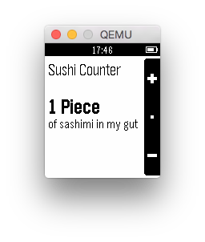

# sushi-counter

This example shows how to use the [`Persistent Storage`](https://developer.getpebble.com/docs/c/group___storage.html) API.

Modifications:
  - Ability to switch items (single press SELECT)
  - Increment by 8 at a time (press and hold UP)
  - Decrement by 8 at a time (press and hold DOWN)
  - Reset all items (press and hold SELECT)
